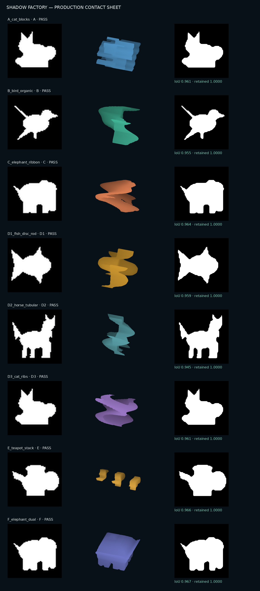

# SHADY

빛을 향해 추상 3D 오브젝트를 돌리고, 목표 실루엣을 찾는 세로형 모바일 그림자 퍼즐 프로토타입입니다.

[모바일 웹 데모](https://jukim2.github.io/Shady/) · [레벨 생성 파이프라인](./00_README_KO.md) · [검증 결과](./07_VALIDATION_REPORT.md)



## 지금 테스트할 수 있는 것

- 메인 → 3개 카테고리 → 8개 레벨 탐색
- 한 손가락 드래그로 실제 OBJ 오브젝트 회전
- 현재 투영과 목표 실루엣의 IoU 실시간 비교
- 88% 이상 일치 시 클리어, 최고 기록은 기기에 저장
- 처음 각도, 단계형 힌트, 다음 퍼즐 이동
- iPhone/Android 세로 화면과 safe area 대응

테스트 버전이라 모든 레벨은 처음부터 열려 있습니다. 웹은 향후 네이티브 셸로 감싸기 전 게임플레이 검증용입니다.

## 로컬 실행

Node.js 22 이상에서 실행합니다.

```bash
npm install
npm run dev
```

프로덕션 검증:

```bash
npm run check
```

## 프로젝트 구조

```text
web/                  모바일 웹 게임
  src/data/           카테고리·레벨 메타데이터
  src/game/           Three.js 플레이어와 실루엣 판정
src/                  Python 3D 레벨 생성기
configs/              생성/검증 설정
assets/targets/       원본 목표 실루엣
output/               검증된 OBJ·이미지·레벨 데이터
tests/                Python 생성기 스모크 테스트
.github/workflows/    CI와 GitHub Pages 배포
```

## 레벨 다시 생성하기

```bash
python -m venv .venv
source .venv/bin/activate
pip install -r requirements.txt
make smoke
make batch
```

각 레벨은 실제 메시 투영 검증을 통과해야 `output/`에 포함됩니다. 상세 생성 원리와 수용 기준은 [프로젝트 개요](./01_PROJECT_OVERVIEW.md)부터 순서대로 확인할 수 있습니다.

## 배포

`main` 브랜치에 push하면 GitHub Actions가 웹 테스트와 Vite 빌드를 실행한 뒤 GitHub Pages에 배포합니다. Python 생성기는 별도 CI에서 스모크 테스트합니다.

## License

[MIT](./LICENSE)
